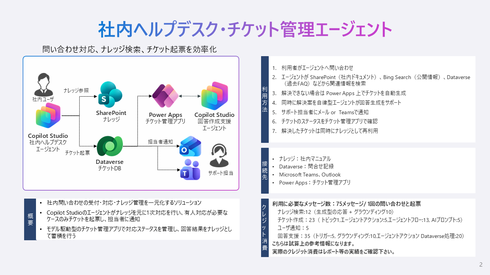

# 社内ヘルプデスク・チケット管理エージェント

## アプリケーション概要

社内の問い合わせ（チケット）の受付・対応・ナレッジ管理を一元化するソリューションです。Copilot Studio エージェントによる AI 回答案の生成、チケットクローズ時のナレッジ記事自動作成など、対応業務を効率化します。9 種類のチャートでチケットの状況をリアルタイムに可視化でき、ヘルプデスク業務の改善に活用できます。

## キャプチャ



## 構成

- README.md
- HelpDeskGeneric_1_1_0_3.zip：アンマネージドソリューション
- SampleData_HelpDesk.xlsx：サンプルデータ（カテゴリ・チケット・ナレッジ記事）

## 展開・利用に必要な条件

- Power Apps Premium ライセンス（開発者・利用者）
- Microsoft Copilot Studio ライセンス（エージェント機能を使用する場合）

## 対応言語

- 日本語

## 主な機能

- チケットの起票・ステータス管理・担当者割当
- 対応履歴の記録（質問内容 → AI 回答案 → 回答内容）
- Copilot Studio エージェントによる AI 回答案生成
  - **Ask Copilot**：担当者が回答案を作成するために利用
  - **Ask Specialist**：エンドユーザーがチケットを起票（カテゴリ自動判定・担当者自動割当）
- ナレッジ記事の作成・レビュー・公開管理
- カテゴリによるチケット・記事の分類（階層対応）
- 9 種類のチャートによる状況可視化
- ビジネスプロセスフロー（BPF）によるプロセス標準化
- チケットクローズ時のナレッジ記事自動生成（Power Automate）
- チケット起票時の自動通知（Power Automate）

## アプリ利用に必要なコネクタ

- Dataverse
- Microsoft Copilot Studio
- Office 365 Outlook

## インストールに必要な権限

- システム管理者（セキュリティロール）

## インストールに必要なソリューション

- 特になし

## インストール方法

1. ソリューション ZIP をダウンロード
2. [Power Apps](https://make.powerapps.com/) にサインイン
3. 対象環境を選択 → ソリューション → インポート
4. ダウンロードした ZIP を選択 → 接続を設定 → 環境変数を設定 → インポート
5. インポート完了後、「初期設定方法」に従って設定
   <br>

## 初期設定方法

### 1. Power Automate フローの設定

ソリューションには以下の 3 つのフローが含まれます。それぞれ接続の認証と有効化が必要です。

| フロー名 | 用途 |
|---|---|
| チケットが起票された場合に呼び出しされる | チケット起票時の通知メール送信 |
| チケットがクローズした場合にナレッジ化 | クローズ時にナレッジ記事を自動生成 |
| エージェントフロー_チケットを起票 | Copilot Studio エージェントからのチケット起票 |

1. [Power Automate](https://make.powerautomate.com/) → 対象環境を選択
2. 各フローを開き、接続の認証を行う
3. フローを **有効化** する

### 2. 環境変数の設定

| 環境変数名 | 設定値 |
|---|---|
| Dataverse URL | インポート先環境の URL（例: `https://yourorg.crm.dynamics.com`） |

> **確認方法**: Power Platform 管理センター → 環境 → 対象環境の「環境URL」

### 3. Copilot Studio エージェントの設定

#### 3.1 ナレッジの追加

1. [Copilot Studio](https://copilotstudio.microsoft.com/) を開く
2. インポート先の環境を選択
3. 対象エージェント（Ask Copilot / Ask Specialist）を開く
4. 左メニュー「**ナレッジ**」→ Dataverse テーブルを追加

#### 3.2 ツール（Dataverse MCP）の設定

1. エージェント画面 → 左メニュー「**ツール**」
2. Dataverse コネクタを追加し、CRUD アクションを有効化
3. 接続が「接続済み」であることを確認

#### 3.3 エージェントの公開

1. 左メニュー → 「**公開**」→「**公開**」ボタンをクリック
2. 公開完了まで 1〜2分待機

### 4. カテゴリマスタの登録

カテゴリテーブルにはソリューションインポート時にデータが含まれません。業務に合わせてカテゴリを登録してください。

**サンプルデータ（参考）:**

| カテゴリ名 |
|---|
| IT インフラ |
| アプリケーション |
| アカウント管理 |
| ハードウェア |
| その他 |

登録方法:
- モデル駆動型アプリ「社内ヘルプデスク」→ サイトマップ「カテゴリ」から手動登録

### 5. カテゴリ × 担当者の関連登録

エージェント（Ask Specialist）がチケット起票時にカテゴリに基づいて担当者を自動割当するため、カテゴリと担当者の N:N 関連を登録してください。

### 6. セキュリティロールの設定

利用者に **Basic User** ロールを付与してください。

### 7. アプリの共有・公開

1. Power Apps メーカーポータル → ソリューション → アプリデザイナーからアプリを公開
2. 利用者・セキュリティグループにアプリを共有
   <br>

## FAQ

- Q. 内容や機能をカスタマイズすることは可能ですか？
  - A. 可能です。カスタマイズすることを前提にシンプルで汎用的な作りになっています
- Q. 展開パートナーはどのように見つけることができますか？
  - A. 日本マイクロソフト営業担当者までお問い合わせください
  <br>

## 免責事項

本アプリ集は日本マイクロソフトが提供する無償のサンプル群です。本アプリ集をダウンロードされた方は、以下の免責事項を承諾したものとみなされます。

1.　本アプリ集（本アプリ集に付属するドキュメント及びReadmeに記載されている技術情報を含みます。以下、本「免責事項」において同じ。）は利用者に対して「現状のまま」提供されるものであり、日本マイクロソフトは、本アプリ集にプログラミング上の誤りその他の瑕疵のないこと、本アプリ集が利用者の目的に適合すること、並びに本アプリ集及びその使用が利用者または利用者以外の第三者の権利を侵害するものでないこと、その他のいかなる内容についての明示または黙示の保証を行うものではありません。

2.　日本マイクロソフトは、本アプリ集の使用に起因して、利用者に生じた損害または第三者からの請求に基づく利用者の損害について、原因の如何を問わず、一切の責任を負いません。日本マイクロソフトは、本アプリ集に関連して利用者と第三者との間に発生するいかなる紛争について、一切責任を負わないものとします。本アプリ集の利用は、利用者の責任のもとで行ってください。

3.　日本マイクロソフトは、本アプリ集の全部または一部の提供を廃止することがあります。提供の廃止によって利用者に発生した損害について、日本マイクロソフトは一切責任を負いません。

4.　日本マイクロソフトは、本アプリ集のバグ修正、補修、保守、機能追加その他のいかなる義務も負いません。本アプリ集は、不定期に更新される可能性がありますが、バグ修正等が保証されているわけではありません。本アプリ集の安定した動作を確保するためには、利用者自身が適切なテストや検証を行ってください。

5.　日本マイクロソフトは、本アプリ集に関するお問い合わせにはお答えできません。ご利用にあたっては、提供された手順書を参照し、ご自身でのインストールや利用を行ってください。

2026年4月吉日

---

## Appendix A: システム構成

```
┌─────────────┐                  ┌────────────────────────┐
│  ユーザー     │ ────────────────→ │  Copilot Studio        │
│  （ブラウザ）   │   チャット        │  Ask Specialist         │
└─────────────┘                  │  Ask Copilot            │
                                   └────────────┬───────────┘
                                                │ Dataverse MCP
                                   ┌────────▼─────────┐
                                   │    Dataverse          │
                                   │  チケット / ナレッジ  │
                                   └────────┬─────────┘
                                                │ 参照・編集
                                   ┌────────▼─────────────┐
                                   │  Model-Driven App       │
                                   │  「社内ヘルプデスク」       │
                                   └───────────────────────┘
```

### 含まれるコンポーネント

| # | コンポーネント | 種類 | 説明 |
|---|---|---|---|
| 1 | チケット (`new_ticket`) | Dataverse テーブル | 問い合わせチケットを管理 |
| 2 | ナレッジ記事 (`new_knowledgearticle`) | Dataverse テーブル | 対応ナレッジを管理 |
| 3 | カテゴリ (`new_category`) | Dataverse テーブル | チケット・ナレッジの分類マスタ |
| 4 | 社内ヘルプデスク | Model-Driven App | チケット・ナレッジの参照・編集・管理 |
| 5 | Ask Copilot | Copilot Studio | 担当者向け AI 回答案生成エージェント |
| 6 | Ask Specialist | Copilot Studio | エンドユーザー向けチケット起票エージェント |
| 7 | Power Automate フロー (3個) | フロー | 起票通知・ナレッジ自動生成・エージェント連携 |
| 8 | BPF (2個) | ビジネスプロセスフロー | チケット管理・ナレッジ管理プロセス |
| 9 | チャート (9個) | システムチャート | ステータス別・優先度別・カテゴリ別等 |
| 10 | 環境変数 | 環境変数 | Dataverse URL |
