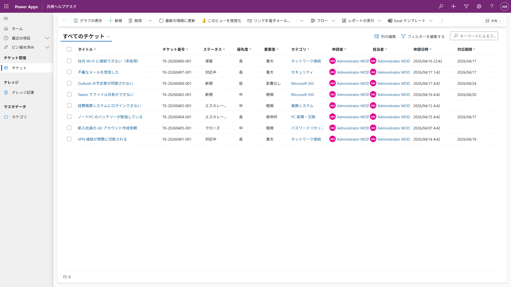
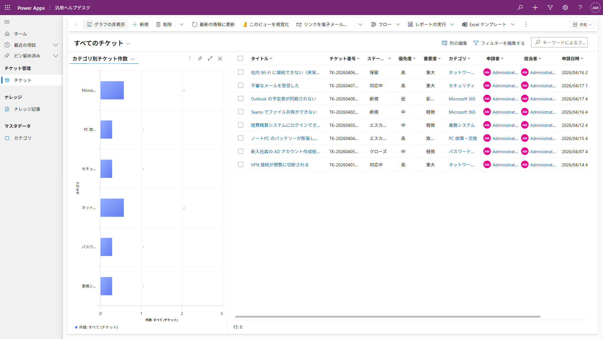
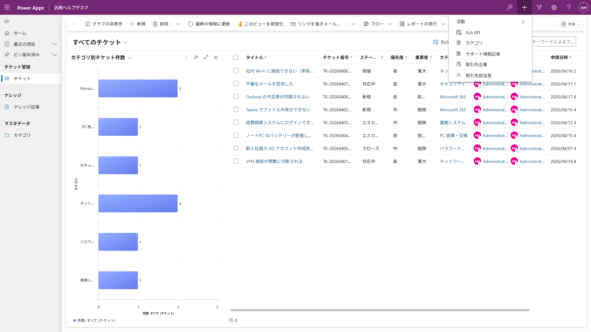
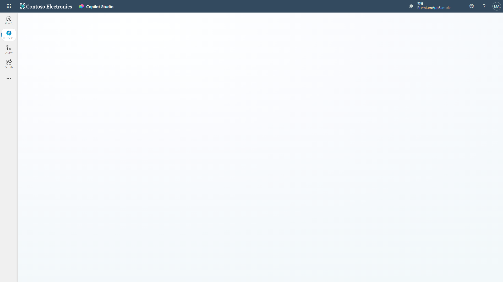

# 汎用ヘルプデスク

## アプリケーション概要

汎用ヘルプデスクは、社内の問い合わせ（チケット）の受付・対応・ナレッジ管理を一元化するモデル駆動型アプリです。
Copilot Studio エージェントによる AI 回答案の生成、チケットクローズ時のナレッジ記事自動作成など、対応業務を効率化します。
9 種類のチャートでチケットの状況をリアルタイムに可視化でき、ヘルプデスク業務の改善に活用できます。

## キャプチャ

|                  チケット一覧                   |                  ナビゲーション                  |
| :---------------------------------------------: | :----------------------------------------------: |
|  |  |

|               チャート                |                  チケット起票                  |
| :-----------------------------------: | :--------------------------------------------: |
|  |  |

|                        Ask Specialist                         |                       Ask Copilot                       |
| :-----------------------------------------------------------: | :-----------------------------------------------------: |
|  |  |

## フォルダ構成

```
HelpDeskGeneric/
├── docs/
│   ├── images/                          # スクリーンショット
│   ├── Solution/                        # ソリューション ZIP
│   ├── DEPLOYMENT_GUIDE.md              # 導入手順書（Markdown）
│   ├── USER_MANUAL.md                   # 利用マニュアル（Markdown）
│   ├── 汎用ヘルプデスク_ソリューション導入手順書.docx
│   └── 汎用ヘルプデスク_利用マニュアル.docx
├── scripts/
│   ├── auth_helper.py                   # 認証ヘルパー
│   ├── setup_dataverse.py               # Dataverse テーブル構築
│   ├── deploy_agent.py                  # Copilot Studio エージェント設定
│   ├── deploy_flow*.py                  # Power Automate フローデプロイ
│   ├── create_charts.py                 # チャート作成
│   ├── insert_sample_data.py            # サンプルデータ投入
│   └── requirements.txt                 # Python 依存関係
├── src/                                 # Code Apps ソース（スターターテンプレート）
├── public/                              # 静的アセット
├── styles/                              # Tailwind CSS
├── plugins/                             # Vite プラグイン
├── package.json
├── vite.config.ts
├── .env.example
├── SAMPLES.md
└── README.md                            # ← このファイル
```

## 展開・利用に必要な条件

- Power Apps Premium ライセンス（開発者・利用者）
- Microsoft Copilot Studio ライセンス（エージェント機能を使用する場合）

## 対応言語

- 日本語

## 主な機能

- チケットの起票・ステータス管理・担当者割当
- 対応履歴の記録（質問内容 → AI 回答案 → 回答内容）
- Copilot Studio エージェントによる AI 回答案生成
  - **Ask Copilot**：担当者が回答案を作成するために利用
  - **Ask Specialist**：エンドユーザーがチケットを起票（カテゴリ自動判定・担当者自動割当）
- ナレッジ記事の作成・レビュー・公開管理
- カテゴリによるチケット・記事の分類（階層対応）
- 9 種類のチャートによる状況可視化
- ビジネスプロセスフロー（BPF）によるプロセス標準化
- チケットクローズ時のナレッジ記事自動生成（Power Automate）
- チケット起票時の自動通知（Power Automate）

## アプリ利用に必要なコネクタ

- Dataverse
- Microsoft Copilot Studio
- Office 365 Outlook

## インストール方法

1. `docs/Solution/` から ZIP をダウンロード
2. [Power Apps](https://make.powerapps.com/) にサインイン
3. 対象環境を選択 → ソリューション → インポート
4. ZIP を選択 → 「次へ」→ 接続設定 → 環境変数設定 → 「インポート」

詳細は [導入手順書](docs/汎用ヘルプデスク_ソリューション導入手順書.docx) を参照してください。

## 初期設定方法

- Power Automate フローの接続認証・有効化
- 環境変数の設定（Dataverse URL）
- セキュリティロールの割当
- カテゴリのマスタデータ登録
- Copilot Studio エージェントのナレッジ・ツール設定
- アプリの共有・公開

## オプションスクリプト

ソリューションインポート後に追加で使えるスクリプトです。

```bash
cd HelpDeskGeneric

# チャート作成（ソリューションに含まれない追加チャートを作成）
python scripts/create_charts.py

# サンプルデータ投入（デモ用）
python scripts/insert_sample_data.py
```

## マネージドソリューションとアンマネージドソリューション

2種類のソリューションを用意しています。インストールにはマネージドソリューションを使用することをおすすめします。アンマネージドは開発環境への展開や、追加の開発・カスタマイズを実施する環境で展開してください。

## FAQ

- **Q. 内容や機能をカスタマイズすることは可能ですか？**
  - A. 可能です。カスタマイズすることを前提にシンプルで汎用的な作りになっています。

- **Q. 展開パートナーはどのように見つけることができますか？**
  - A. 日本マイクロソフト営業担当者までお問い合わせください。

## 免責事項

本アプリ集は日本マイクロソフトが提供する無償のサンプル群です。本アプリ集をダウンロードされた方は、以下の免責事項を承諾したものとみなされます。

1. 本アプリ集は利用者に対して「現状のまま」提供されるものであり、日本マイクロソフトは、いかなる内容についての明示または黙示の保証を行うものではありません。

2. 日本マイクロソフトは、本アプリ集の使用に起因して、利用者に生じた損害について、一切の責任を負いません。

3. 日本マイクロソフトは、本アプリ集の全部または一部の提供を廃止することがあります。

4. 日本マイクロソフトは、本アプリ集のバグ修正、補修、保守、機能追加その他のいかなる義務も負いません。

5. 日本マイクロソフトは、本アプリ集に関するお問い合わせにはお答えできません。

2026年4月吉日
