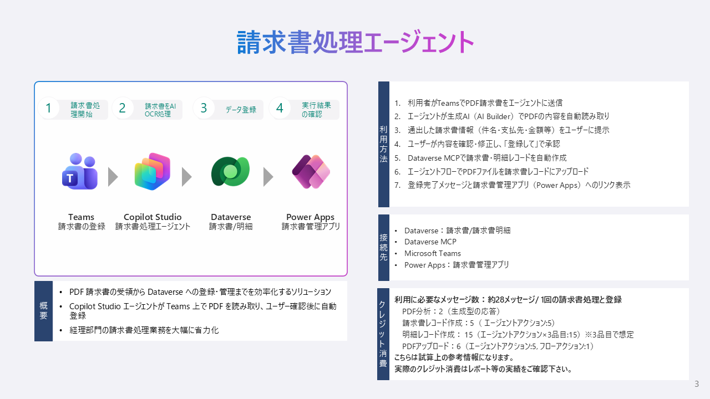

# 請求書処理ソリューション (InvoiceProcessor)

## アプリケーション概要

PDF 請求書の受領から Dataverse への登録・管理までを効率化するソリューションです。Copilot Studio エージェントが Teams 上で PDF を読み取り、ユーザー確認後に自動登録。モデル駆動型アプリ（MDA）で一覧・編集・管理を行います。経理部門の請求書処理業務を大幅に省力化します。

## キャプチャ



## 構成

- README.md
- InvoiceProcessor_1_0_0_3.zip：アンマネージドソリューション
- InvoiceProcessor_1_0_0_4_managed.zip：マネージドソリューション


## 展開・利用に必要な条件

- Power Apps Premium ライセンス（開発者・利用者）
- Copilot Studio ライセンス（エージェント利用）
- Microsoft Teams（エージェントチャネル）

## 対応言語

- 日本語

## 主な機能

- Copilot Studio エージェントによる PDF 請求書の AI 分析・自動登録
  - Teams 上で PDF をアップロードするだけで請求書情報を抽出
  - ユーザー確認後、Dataverse に自動登録（請求書 + 明細 + PDF ファイル）
- Model-Driven App による請求書管理
  - 請求書の一覧表示・検索・フィルタリング
  - PDF ビューアーによる請求書原本の確認
  - 勘定科目・原価センタの紐付け管理
- マスタデータ管理（勘定科目）

## アプリ利用に必要なコネクタ

- Dataverse
- Copilot Studio（Dataverse MCP）

## インストールに必要な権限

- システム管理者（セキュリティロール）

## インストールに必要なソリューション

- 特になし

## インストール方法

1. ソリューション ZIP をダウンロード
2. [Power Apps](https://make.powerapps.com/) にサインイン
3. 対象環境を選択 → ソリューション → インポート
4. ダウンロードした ZIP を選択 → 接続を設定 → インポート
5. インポート完了後、「初期設定方法」に従って設定
   <br>

## 初期設定方法

### 1. Copilot Studio エージェントの設定

#### 1.1 エージェント指示の修正

1. [Copilot Studio](https://copilotstudio.microsoft.com/) を開く
2. インポート先の環境を選択
3. 「請求書処理エージェントv2」を開く
4. 左メニュー「**概要**」→「**指示**」欄の内容を確認
   - 指示はソリューションに含まれていますが、環境固有のURLが含まれているため修正が必要です

指示内の「応答内容」セクションに含まれるアプリURLを、導入先環境に合わせて修正してください。

| 修正箇所 | 変更前（例） | 変更後 |
|---|---|---|
| アプリURL内の `orgXXX.crmN.dynamics.com` | `org6c294f95.crm.dynamics.com` | 導入先環境のOrg URL |
| アプリURL内の `appid=XXXX` | `appid=57a5119c-ff33-44ee-8f08-d0338473051a` | 導入先のアプリID |

> **Org URL の確認方法**: Power Platform 管理センター → 環境 → 対象環境の「環境URL」を確認
>
> **アプリID の確認方法**: Power Apps メーカーポータル → ソリューション → InvoiceProcessor → 「請求書処理」アプリを選択 → 「詳細」タブで AppId を確認

#### 1.2 生成AI設定の有効化

1. エージェント画面 → 左メニュー「**設定**」→「**生成 AI**」
2. 以下を確認・有効化:

| 設定 | 必要な値 |
|------|---------|
| Generative AI で回答を生成 | **オン** |
| ファイル分析を有効にする | **オン** |
| セマンティック検索を有効にする | **オン** |

#### 1.3 Dataverse コネクタの接続確認

エージェントが Dataverse にレコードを作成するため、コネクタの接続が有効であることを確認してください。

1. エージェント画面 → 左メニュー「**設定**」→「**Generative AI**」→「**Generative Actions**」
2. 「Generative Actions を有効にする」が **オン** であることを確認
3. Dataverse コネクタの接続が「接続済み」であることを確認
   - 未接続の場合は、「接続を追加」から認証を行ってください

#### 1.4 エージェントの公開

1. 左メニュー → 「**公開**」→「**公開**」ボタンをクリック
2. 公開完了まで 1〜2分待機

#### 1.5 Teams チャネルへの展開

1. 左メニュー → 「**チャネル**」→「**Microsoft Teams**」
2. 「**Teams で開く**」をクリック → Teams アプリとしてインストール
3. （任意）特定チームのチャネルにタブとして追加

### 2. 勘定科目マスタの初期データ投入

勘定科目テーブルにはソリューションインポート時にデータが含まれません。導入先の会計体系に合わせて、勘定科目マスタを登録してください。

**サンプルデータ（参考）:**

| コード | 科目名 | カテゴリ |
|--------|--------|---------|
| 5100 | 原材料費 | 製造原価 |
| 5200 | 外注加工費 | 製造原価 |
| 6100 | 消耗品費 | 一般管理費 |
| 6200 | 運送費 | 一般管理費 |
| 6300 | 修繕費 | 一般管理費 |
| 6400 | 通信費 | 一般管理費 |
| 6500 | 保守サービス費 | 一般管理費 |
| 7100 | 設備投資 | 資本的支出 |

登録方法:
- Model-Driven App「請求書処理」→ サイトマップ「マスタ管理」→「勘定科目」から手動登録
- または、Excel からのデータインポート機能を利用

### 3. セキュリティロールの設定

ソリューションには基本的なセキュリティロールが含まれていますが、導入先の組織構造に合わせて権限を調整してください。

**推奨ロール構成:**

| ロール名 | 対象ユーザー | 権限概要 |
|----------|------------|---------|
| 請求書申請者 | 一般社員 | 請求書・明細の作成/自分のレコードの読取・更新・削除、マスタは読取のみ |
| 請求書管理者 | 管理部門 | 全テーブルの全権限 |
   <br>

## マネージドソリューションとアンマネージドソリューション

2種類のソリューションを用意しています。インストールにはマネージドソリューションを使用することをおすすめします。アンマネージドは開発環境への展開や、追加の開発・カスタマイズを実施する環境で展開してください。
<br>

## FAQ

- Q. 内容や機能をカスタマイズすることは可能ですか？
  - A. 可能です。カスタマイズすることを前提にシンプルで汎用的な作りになっています
- Q. 展開パートナーはどのように見つけることができますか？
  - A. 日本マイクロソフト営業担当者までお問い合わせください
  <br>

## 免責事項

本アプリ集は日本マイクロソフトが提供する無償のサンプル群です。本アプリ集をダウンロードされた方は、以下の免責事項を承諾したものとみなされます。

1.　本アプリ集（本アプリ集に付属するドキュメント及びReadmeに記載されている技術情報を含みます。以下、本「免責事項」において同じ。）は利用者に対して「現状のまま」提供されるものであり、日本マイクロソフトは、本アプリ集にプログラミング上の誤りその他の瑕疵のないこと、本アプリ集が利用者の目的に適合すること、並びに本アプリ集及びその使用が利用者または利用者以外の第三者の権利を侵害するものでないこと、その他のいかなる内容についての明示または黙示の保証を行うものではありません。

2.　日本マイクロソフトは、本アプリ集の使用に起因して、利用者に生じた損害または第三者からの請求に基づく利用者の損害について、原因の如何を問わず、一切の責任を負いません。日本マイクロソフトは、本アプリ集に関連して利用者と第三者との間に発生するいかなる紛争について、一切責任を負わないものとします。本アプリ集の利用は、利用者の責任のもとで行ってください。

3.　日本マイクロソフトは、本アプリ集の全部または一部の提供を廃止することがあります。提供の廃止によって利用者に発生した損害について、日本マイクロソフトは一切責任を負いません。

4.　日本マイクロソフトは、本アプリ集のバグ修正、補修、保守、機能追加その他のいかなる義務も負いません。本アプリ集は、不定期に更新される可能性がありますが、バグ修正等が保証されているわけではありません。本アプリ集の安定した動作を確保するためには、利用者自身が適切なテストや検証を行ってください。

5.　日本マイクロソフトは、本アプリ集に関するお問い合わせにはお答えできません。ご利用にあたっては、提供された手順書を参照し、ご自身でのインストールや利用を行ってください。

2026年4月吉日

---

## Appendix A: システム構成

```
┌─────────────┐    PDF添付     ┌──────────────────────┐
│   Teams     │ ─────────────→ │  Copilot Studio      │
│  ユーザー    │               │  請求書処理エージェント │
└─────────────┘               └────────┬─────────────┘
                                       │ ファイル分析 (生成AI)
                                       │ → 抽出結果をユーザーに提示
                                       │ → ユーザー確認後
                                       │ Dataverse MCP で登録
                              ┌────────▼─────────┐
                              │    Dataverse      │
                              │  請求書 / 明細     │
                              └────────┬─────────┘
                                       │ 参照・編集
                              ┌────────▼──────────────┐
                              │  Model-Driven App     │
                              │  「請求書処理」         │
                              └───────────────────────┘
```

### エージェントの処理フロー

```
1. ユーザーが Teams で PDF 請求書を添付送信
   ↓
2. エージェントがファイル分析（生成AI）で PDF を読み取り
   ↓
3. 抽出結果をユーザーに提示（件名、支払先、金額、明細、銀行情報等）
   ↓
4. ユーザーが内容を確認・修正 → 「登録して」で承認
   ↓
5. Dataverse MCP で登録（3ステップ）
   Step 1: 請求書レコード作成
   Step 2: 明細行レコード作成（品目数分）
   Step 3: PDF ファイルアップロード（エージェントフロー経由）
   ↓
6. 登録完了メッセージ + アプリへのリンク表示
```

### 含まれるコンポーネント

| # | コンポーネント | 種類 | 説明 |
|---|---|---|---|
| 1 | 請求書 (`inv_invoice`) | Dataverse テーブル | 請求書ヘッダー情報を管理 |
| 2 | 請求明細 (`inv_invoicelineitem`) | Dataverse テーブル | 請求書の明細行を管理 |
| 3 | 勘定科目 (`inv_accountcode`) | Dataverse テーブル | 勘定科目マスタ |
| 4 | 支払先 (`inv_vendor`) | Dataverse テーブル | 支払先マスタ（Lookup依存用） |
| 5 | 原価センタ (`inv_costcenter`) | Dataverse テーブル | 原価センタマスタ（Lookup依存用） |
| 6 | 税コード (`inv_taxcode`) | Dataverse テーブル | 税コードマスタ（Lookup依存用） |
| 7 | 請求書処理 | Model-Driven App | 請求書の参照・編集・管理アプリ |
| 8 | 請求書処理エージェントv2 | Copilot Studio | PDF読み取り → Dataverse登録エージェント |
| 9 | WebResource (6個) | Web リソース | PDF ビューアー、入力フォーム等 |

## Appendix B: テーブル構成

### ER図

```
inv_Invoice (請求書)
    │ 1:N
    ▼
inv_InvoiceLineItem (請求明細)
    │ N:1
    ▼
inv_AccountCode (勘定科目)
```

※ 以下のテーブルは Lookup 依存解決のためソリューションに含まれていますが、サイトマップ上のナビゲーションには表示されません。

- `inv_vendor`（支払先マスタ）
- `inv_costcenter`（原価センタマスタ）
- `inv_taxcode`（税コードマスタ）

### 請求書テーブル (inv_invoice)

| 列名 | 表示名 | 型 | 必須 | 説明 |
|------|--------|-----|------|------|
| inv_subject | 件名 | String (300) | ○ | プライマリ列。請求書の概要 |
| inv_invoicenumber | 申請番号 | Auto-number | 自動 | `INV-{SEQNUM:6}` |
| inv_invoicedate | 請求書日付 | Date | | 請求書の発行日 |
| inv_externalinvoicenumber | 請求書番号（外部） | String (50) | | 請求書に記載された番号 |
| inv_invoiceissuernumber | 適格事業者番号 | String (14) | | T+13桁 |
| inv_applicationstatus | 申請ステータス | Choice | ○ | 下書き(74000060), 確認中(74000061), 承認済み(74000062), 否決(74000063), 引戻し(74000064) |
| inv_totalamount | 支払額 | Money | | 税込合計金額 |
| inv_currency | 通貨 | String (3) | | 既定: JPY |
| inv_paymentpreference | 支払希望 | Choice | ○ | 月末締翌月末支払(74000010), スポット支払(74000011), 口座引落(74000012) |
| inv_desiredpaymentdate | 支払希望日 | Date | | 支払期限日 |
| inv_budgetcategory | 予算区分 | Choice | ○ | 予算内(74000020), 予算外(74000021) |
| inv_budgetapprovalnumber | 稟議決裁番号 | String (50) | | 予算外時に使用 |
| inv_receiptdataformat | 受領データ形式 | Choice | ○ | 紙スキャン(74000030), 電子取引MFZ(74000031), 電子取引RICOH(74000032) |
| inv_hasmanufacturedparts | 部品納入有無 | Choice | | 有(74000040), 無(74000041) |
| inv_bankname | 銀行名 | String (100) | | |
| inv_branchname | 支店名 | String (100) | | |
| inv_accountholder | 口座名義 | String (100) | | |
| inv_accountnumber | 口座番号 | String (20) | | |
| inv_deposittype | 預金種別 | Choice | | 普通(74000070), 当座(74000071), その他(74000072) |
| inv_remarks | 備考 | Memo (5000) | | |
| inv_invoicepdf | 請求書PDF | File (128MB) | | |
| inv_contractfile | 契約書添付 | File (128MB) | | |
| inv_vendorid | 支払先 | Lookup → inv_vendor | | |
| cr890_account | 支払先 | String | | エージェントが設定するテキスト列 (SchemaName: cr890_Account) |
| ownerid | 所有者 | Owner | ○ | レコード所有者 |

### 請求明細テーブル (inv_invoicelineitem)

| 列名 | 表示名 | 型 | 必須 | 説明 |
|------|--------|-----|------|------|
| inv_linedescription | 摘要 | String (200) | ○ | プライマリ列。品目名 |
| inv_linenumber | 行番号 | Integer | ○ | 表示順 |
| inv_ordernumber | 指図番号 | String (50) | | |
| inv_amount | 金額 | Money | ○ | |
| inv_taxamount | 税額 | Money | | |
| inv_netamount | 税込金額 | Money | | |
| inv_invoiceid | 請求書 | Lookup → inv_invoice | ○ | 親請求書。カスケード削除 |
| inv_accountcodeid | 勘定科目 | Lookup → inv_accountcode | | |
| inv_costcenterid | 原価センタ | Lookup → inv_costcenter | | |
| inv_taxcodeid | 税コード | Lookup → inv_taxcode | | |

### 勘定科目テーブル (inv_accountcode)

| 列名 | 表示名 | 型 | 必須 | 説明 |
|------|--------|-----|------|------|
| inv_accountcodename | 勘定科目名 | String (200) | ○ | プライマリ列 |
| inv_accountcodenumber | 勘定科目コード | String (20) | ○ | |
| inv_category | 科目カテゴリ | String (100) | | 例: 製造原価, 一般管理費 |
| inv_isactive | 有効 | Boolean | | 既定: true |

### リレーションシップ

| 親テーブル | 子テーブル | リレーション名 | カスケード |
|-----------|-----------|---------------|-----------|
| inv_invoice | inv_invoicelineitem | inv_invoice_lineitem | 削除=カスケード |
| inv_vendor | inv_invoice | inv_vendorid | — |
| inv_accountcode | inv_invoicelineitem | inv_accountcodeid | — |
| inv_costcenter | inv_invoicelineitem | inv_costcenterid | — |
| inv_taxcode | inv_invoicelineitem | inv_taxcodeid | — |
